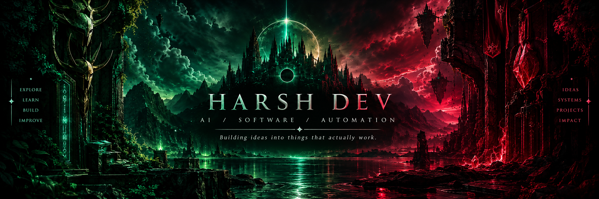
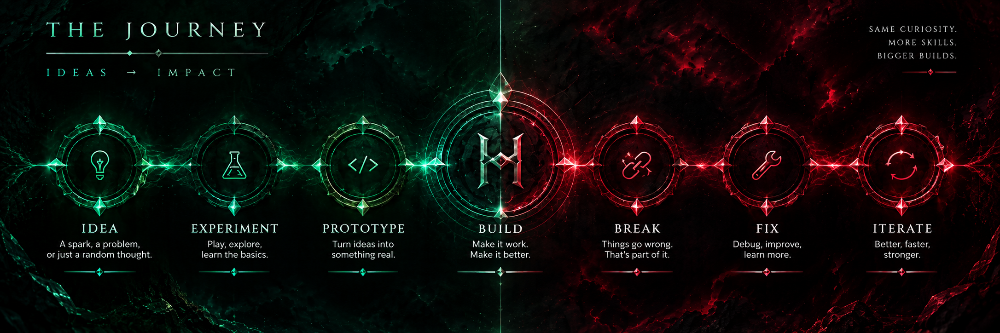
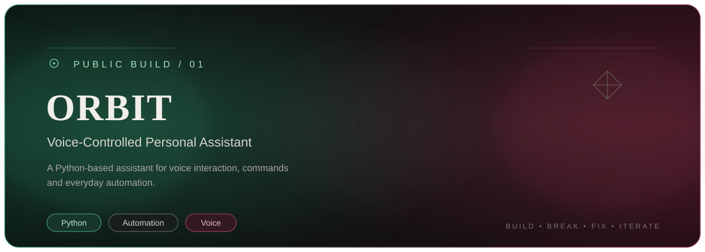
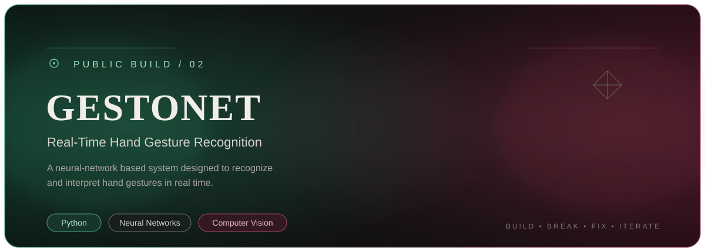
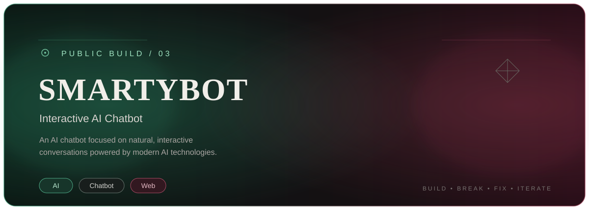

  

 ✦ ABOUT ME

 AI • SOFTWARE • AUTOMATION

I build software around one simple idea:

*turning ideas into things that actually work.*

I enjoy working across AI, automation, backend systems,
application development, and experimental software.

I learn by building — experimenting, breaking things,
fixing them, and turning rough concepts into working systems.

 

---

 

 ◈ WHAT I BUILD

I work across different layers of software rather than staying
inside a single technology.

`ARTIFICIAL INTELLIGENCE`
&nbsp;&nbsp; → &nbsp;&nbsp;
`AUTOMATION`
&nbsp;&nbsp; → &nbsp;&nbsp;
`BACKEND`
&nbsp;&nbsp; → &nbsp;&nbsp;
`APPLICATIONS`
&nbsp;&nbsp; → &nbsp;&nbsp;
`EXPERIMENTS`

 

---

 ◈ SELECTED BUILDS

  

  

  

  

---

 ◈ TECHNOLOGY

LANGUAGES

  

AI / MACHINE LEARNING

  

DEVELOPMENT

   

  

 CONTRIBUTION ACTIVITY

 

  

&nbsp;

---

 ✦ BUILD WITH CURIOSITY.
 ✦ IMPROVE WITH EVERY ITERATION.

 

`AI` · `SOFTWARE` · `AUTOMATION` · `EXPERIMENTATION`

  

*Harsh Dev*

